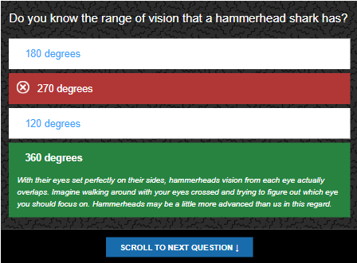
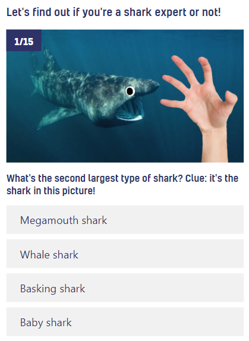
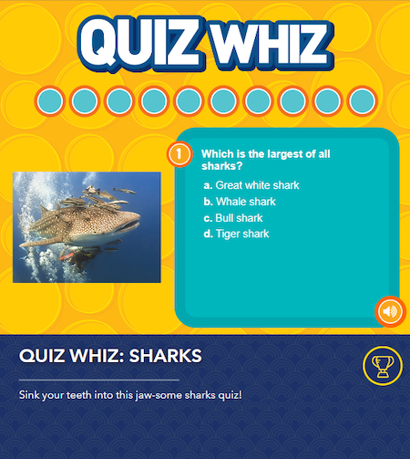

# Research

## Zoo - The Great Shark Quiz

[zoo.com/quiz](https://www.zoo.com/quiz/the-great-shark-quiz)

**What I like**

* Reveals a description, giving you more information and explaining why the answer was correct/incorrect.
* Content is spread out with lots of space which also makes it easier to read.

## Beano - The Ultimate Shark Quiz!

[beano.com](https://www.beano.com/posts/the-ultimate-shark-quiz)

Beano's quiz is aimed at a younger audience through:

* Bright colours
* Pictures on each question
* Googly eyes on the sharks

**What I like**

* It automatically scrolls the user to the next question.

**What I dislike**

* I think they could've sized the questions/answers better by keeping them within the height of the viewport.

## National Geographic Kids - Quiz Wiz

[natgeokids.com](https://www.natgeokids.com/uk/play-and-win/games/quiz-whiz-sharks/)

Beano and natgeokids have a few things in common:

* Bright colours
* Pictures on each question

Natgeokids does have a more interesting theme and it is visually evident that the target audience is children. 

**What I like**

* It shows you how many questions you have answered correctly or incorrectly and how many questions are left.

* It also displays a description after answering a question.

    
