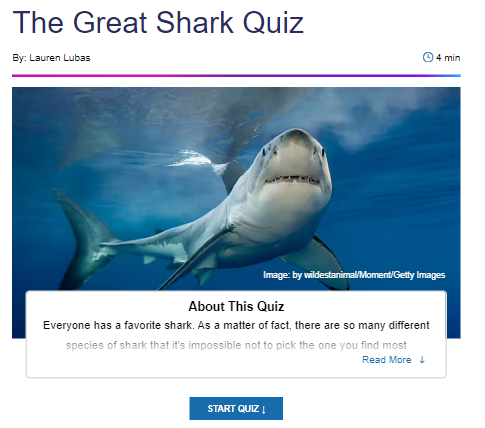
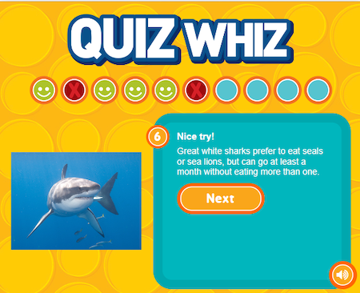

# Research

## Zoo - The Great Shark Quiz

[zoo.com/quiz](https://www.zoo.com/quiz/the-great-shark-quiz)

;

What I liked most about this quiz, was that it revealed a description telling you more information and why the answer was correct/incorrect.

## Beano - The Ultimate Shark Quiz!

* [beano.com](https://www.beano.com/posts/the-ultimate-shark-quiz)

Beano's quiz is aimed more at children and they cater well to this audience through:
* Bright colours
* Pictures on each question
* Googly eyes on the sharks

I like that they scroll the user to the next question.
I think they could've size the questions/answers better by keeping them within the height of the viewport.

## National Geographic Kids - Quiz Wiz

* [natgeokids.com](https://www.natgeokids.com/uk/play-and-win/games/quiz-whiz-sharks/)

Beano and natgeokids have a few things in common:
* Bright colours
* Pictures on each question

Natgeokids does have a more interesting theme and is evident that the target audience is children. 

I like that it shows you how many questions you have answered correctly or incorrectly and how many questions are left.

It also displays a description after answering a question.
