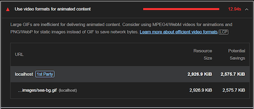

# **Shark Facts** - Milestone Project 2

Shark Facts is a simple, online quiz put your shark knowledge to the test!

This project demonstrates my ability to use JavaScript, JQuery and external APIs after studying the modules with Code Institue. It also builds on my knowledge of HTML5, CSS3 and UX design but primarily showcases my skills in making an interactive website.

[View the live project here.](https://codeinstitute.net)


## User Experience (UX)

### Project Goals

I will be creating an online quiz on shark facts. My target audience will be anyone who loves sharks (such as my partner). This will likely include all ages.

The site owner's goal aligns with the site user's goal which is to enjoy testing their knowledge on sharks. 
In future, the site owner may want to utilise the website's traffic to gain ad revenue.

### User Stories

1. As a first-time user, I want to be able to start the game quickly and with ease.
2. As a first-time user, I want feedback after answering each question.
3. As a first-time user, I want to see what score I achieve.
4. As a recurring user, I want to compete against previous scores.

### Strategy Plane

#### User Goals

Most people who visit the website are likely to be one-time users who were searching for a quick quiz to play. The website needs to be intuitive to use and quick to get started.

#### Research

You can find the research I conducted for this project [by clicking this link](docs/research/research.md).

### Scope Plane

Features to include:
* Home page - Showing all the options available to the user.
* A leaderboard to showcase previous scores saved in the user's cookies.
* A way to view instructions on how to play.
* A way to contact the developer.
* The quiz involving a question with the option of 3 possible answers.
* A score that is incremented you guess a question correctly.
* A timer - any time left for that question is added to the score.

Features to include in future:
* A way to store scores globally.
* An interface for the site owner to add new questions.

### Structure Plane

The majority of the quiz will feel like an application as it resides largely on only one page.

There will be a homapage with the following:
* An option to view the leaderboard.
* An option to view the instructions.
* A box to input a username before starting the quiz.
* A 'Start Quiz' button that works after the username is inputted.

Once the game has started, there will be a question with a 'next question' icon to the right of it. 
Below this, there will be three answers for the user to choose from. 

Once the quiz has ended, the user's score will be displayed.

### Skeleton Plane

I have created my wireframe in Figma. To see the comments I've made, you will need to view the wireframe logged into an account such as a Google account.

You can find my [Figma wireframe design here](https://www.figma.com/file/oSBxvFvlEHhYofP2wkHW3p/Facts-From-The-Deep). 

### Surface Plane

I decided to use the fonts

As sharks are creatures of the sea, I will be using a colour theme consisting primarily of blue.
I will also use an image or gif for the background of the webpage.

## Technologies Used

### Languages Used

* HTML5  
* CSS3
* JavaScript
* JQuery

### Frameworks, Libraries & Programs Used

* Bootstrap 5.0.2:
    * Used for responsiveness out-the-box, utility classes and components that allow for reliable design 
    * Reduce time wasted on reinventing the wheel. 
* Google Fonts
    * Gives easy access to many fonts supplied through a CDN that downloads close to the region of the user. Speeding up delivery.
    * I used the fonts: Assistant and Poppins - used throughout the website. Poppins for content and Assistant for the headings and nav/footer.
* JQuery
    
* Font Awesome 
    * Gives professional icons.
* Git 
    * Used for version control.
* GitHub
    * Used to store commits and to present the project using GitHub pages
* Visual Studio Code
    * Used as the IDE for the project.
    * I set a shortcut for Visual Code to format HTML/CSS (ctrl+shift+f).
* Python - http.server
    * I will use Python to host the website locally during development to allow me to view the website.
* Paint.NET
    * Used to edit and create images for the project such as the homepage hero and the visual FIELDS gif in services.html
* Figma
    * Used to create the mockup of the website before developing.
* Word 
    * Used to present the project requirements in my own words, for project research, and brainstorming.
* Notepad and Notepad++
    * Used for quick notes from my mentor and for notes while developing.
* Chrome - Inspect element
    * This was used to:
        * Style the website and test new ideas to be copied into the project.
        * Continuously test responsiveness by adjusting the screen size and by testing preset device dimensions.
        * Bug fix.
        * Find out how Bootstrap is styling elements.
* Firefox, Microsoft Edge, Safari
    * Used to test compatibility on other browsers.
* [Responsinator](http://www.responsinator.com/) for testing on different screens.
* [Image aspect ratio and resizing calculator](https://red-route.org/code/image-resizing-calculator)
    * For working out what width and height an image should have when first loaded on a mobile
* [Grammarly](https://app.grammarly.com/)
    * To help find grammar and spelling mistakes to correct.
* [Aspect Ratio Calculator](https://aspectratiocalculator.com/)
    * To work out the aspect ratio of images.

## Testing

The W3C Markup Validator and W3C CSS Validator Services were used to validate every page as I went to ensure unexpected errors were kept to a minimum. I used these validators at the end to ensure there were no validation errors upon project submission.

### [W3C Markup Validator](https://validator.w3.org/#validate_by_input)

* [index.html results](docs/validation/html/index-results.webp)
    * I received a warning for a misuse of aria-label on the topbar icons. After research, I concluded  that the button tag would be more appropriate than a div tag for these icons and the next question button.
    * I removed a duplicate "data-visible" tag from the score topbar icon.
    * I am left with a warning for a misuse of aria-label on the trophy icon that has the score displayed next to it. Without this and the described-by attribute, a person with a screenreader wouldn't know their score.

### [W3C CSS Validator](https://jigsaw.w3.org/css-validator/#validate_by_input)

* [style.css results](docs/validation/css/style-results.webp) 

### HTML Validator Notes

### CSS Validator Notes

### JS Validator Notes

### Testing User Stories From The User Experience Section

### Automatic Testing (unit tests)

I had to setup Jest to work with JQuery by importing it. I found this [StackOverflow post](https://stackoverflow.com/questions/45948843/how-to-require-jquery-plugin-in-jest-test-file) explaining how.
1. Add the following to the package.json file:
```
"jest": {
    "setupFiles": [
      "./setup-jest.js"
    ]
  },
```
2. Create a file with the same name referenced above containing:
```
global.window = window
global.$ = require('jquery');
```

My first two tests were:
1. To test that all .game-areas have been hidden by JQuery
2. To test that the #home .game-area is revealed when showHomeScreen() is called

I discovered that elements wouldn't be hidden fast enough meaning all the game-areas would be shown for a second while JQuery loaded. I decided to use the data-attribute "data-visible" instead of using JQuery to hide the elements. Therefore,I removed these first tests.

For the rest of the tests, I followed the red, green, refactor approach.

I spent a lot of time trying to debug why questions from questions.js was an empty array. It turned out that I needed to use "module.exports = questions" instead of "module.exports = {questions}". This fixed my bug in jest.

Event listeners don't work in jest unless they're added after the page is loaded. I fixed this by moving the event listeners over to init();. At first I thought it was to do with JQuery and therefore I tried adding the event listeners using vanilla js. This gave an error through jest saying that the element doesn't exist yet. This prompted me to move the code into init() which worked. I then tried switching back to using JQuery and this worked bringing me to the conclusion I just had to move the code into init().
Had I followed the red, green refractor approach earlier I would have noticed this sooner as the timeout I was using was making the test pass no matter what. 

### Manual Testing

* I clicked through all the topbar icons in different orders.
* I went through every question and answered them repeatedly

### Further Testing

#### Google Lighthouse

According to Google Lighthouse, gifs are inefficient for animated content. On mobile, it can take 12 seconds to load.


I tried converting the 2.86MiB gif into a WebM video using ezgif. This reduced the size to only 180.95KiB, a 93% descrease in file size!


### Known Bugs

### Deployment

#### GitHub Pages

The project was deployed to GitHub Pages using the following steps:

1. Log in to GitHub and locate the GitHub Repository.
2. At the top of the Repository (no, locate the "Settings" Button on the menu.
    * Alternatively Click Here for a GIF demonstrating the process starting from Step 2.
3. Scroll down the Settings page until you locate the "GitHub Pages" Section.
4. Under "Source", click the dropdown called "None" and select "Master Branch".
5. The page will automatically refresh.
6. Scroll back down through the page to locate the w published site link in the "GitHub Pages" section.

#### Forking the GitHub Repository

By forking the GitHub Repository we make a copy of the original repository on our GitHub account to view and/or make changes without affecting the original repository by using the following steps...

1. Log in to GitHub and locate the GitHub Repository
2. At the top of the Repository just above the "Settings" Button on the menu, locate the "Fork" Button.
3. You should now have a copy of the original repository in your GitHub account.

#### Making a Local Clone

1. Log in to GitHub and locate the GitHub Repository
2. Under the repository name, click "Clone or download".
3. To clone the repository using HTTPS, under "Clone with HTTPS", copy the link.
4. Open Git Bash
5. Change the current working directory to the location where you want the cloned directory to be made.
6. Type `git clone`, and then paste the URL you copied in Step 3.

```
$ git clone https://github.com/avabellaw/crystal-clear-opticians
```

7. Press Enter. Your local clone will be created.

```
$ git clone https://github.com/avabellaw/crystal-clear-opticians
> Cloning into `CI-Clone`...
> remote: Counting objects: 10, done.
> remote: Compressing objects: 100% (8/8), done.
> remove: Total 10 (delta 1), reused 10 (delta 1)
> Unpacking objects: 100% (10/10), done.
```

[Click Here](https://help.github.com/en/github/creating-cloning-and-archiving-repositories/cloning-a-repository#cloning-a-repository-to-github-desktop) to retrieve pictures for some of the buttons and more detailed explanations of the above process.

## Credits

### Content

* Questions were inspired by or taken and modified from the following websites.
    * [zoo.com/quiz](https://www.zoo.com/quiz/the-great-shark-quiz);
    * [beano.com](https://www.beano.com/posts/the-ultimate-shark-quiz)
    * [natgeokids.com](https://www.natgeokids.com/uk/play-and-win/games/quiz-whiz-sharks/)
    * [Article from The Sun](https://www.thesun.co.uk/news/3410447/great-white-shark-uk-attacks-british-waters/)

### Code

* I found out how to use jest with JQuery from [StackOverflow](https://stackoverflow.com/questions/45948843/how-to-require-jquery-plugin-in-jest-test-file)
* How to use cookies from [developer.mozilla](https://developer.mozilla.org/en-US/docs/Web/API/Document/cookie)

### Media

#### Images

* 
    * I edited the gif using [ezgif](https://ezgif.com/effects/ezgif-1-d9e8e08506.gif).
* 
    * I edited and resized the image.
* favicon created by me in paint.NET

### Videos