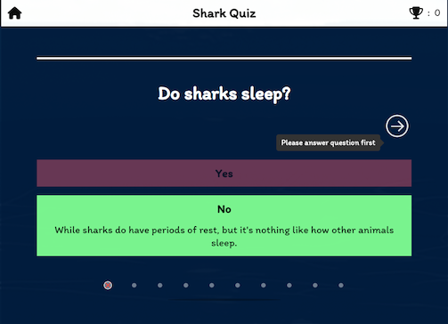
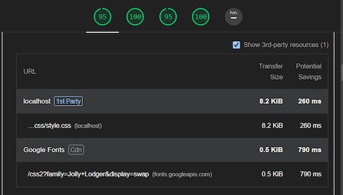

# **Shark Facts** - Milestone Project 2

Shark Facts is a simple, online quiz - put your shark knowledge to the test!

This project demonstrates my ability to use JavaScript, JQuery and external APIs after studying the modules with Code Institute. It also builds on my knowledge of HTML5, CSS3 and UX design but primarily showcases my skills in making an interactive website.

[View the live project here.](https://avabellaw.github.io/shark-quiz/)


## User Experience (UX)

### Project Goals

I will be creating an online quiz on shark facts. My target audience will be anyone who loves sharks (such as my partner). This will likely include all ages particularly younger audiences.

The questions will be in a randomized order and only 50% of the questions will be shown at a time. 
The answers for each question will also have a randomized order.

There will be a timer counting down from 15. If an answer is correct, 10 points + the time left will be added to the score.

The site owner's goal aligns with the site user's goal which are the following:
1. To enjoy testing their knowledge of sharks.
2. Learn more about sharks.
3. See previous high scores.

In future, the site owner may want to:
1. Utilise the website's traffic to gain ad revenue.
2. Have the leaderboard be publically hosted.
3. Have an account, such as a Google account, associated with the username to make it exclusive. This will prevent overwriting other user's scores by using the same username.

### User Stories

1. As a first-time user, I want to be able to start the game quickly and with ease.
2. As a first-time user, I want feedback after answering each question.
3. As a first-time user, I want to see what score I achieve.
4. As a recurring user, I want to compete against previous scores.

### Strategy Plane

#### User Goals

Most people who visit the website are likely to be one-time users, searching for a quick quiz to play. The website needs to be intuitive to use and quick to get started.

#### Research

You can find the research I conducted for this project [by clicking this link](docs/research/research.md).

#### Asynchronisity

Shark-quiz is to be a largely event-driven quiz. The only loop will be an asynchronous timer that doesn't share any variables with other functions. The timer will follow the following process:
1. Wait for one second.
2. Decrement the timer variable.
3. Call a function to respond to the value of the timer. 

Every action is performed by the timer, therefore I will avoid any timing problems caused by variables that are shared with asynchronous functions. For example, trying to access the result of an asynchronous function after calling it but it's not been run yet.


### Scope Plane

Features to include:
* Home page - Showing all the options available to the user.
* A leaderboard to showcase previous scores saved in the user's cookies.
* A way to view instructions on how to play.
* A way to contact the developer.
* The quiz with the option of 3 possible answers for each question.
* A score that is incremented if you guess a question correctly.
* A timer - any time left for that question is added to the score.

Features to include in future:
* A way to store scores globally.
* An interface for the site owner to add new questions.

### Structure Plane

The majority of the quiz will feel like an application as it resides on only one web page.

There will be a homepage with the following:
* An option to view the leaderboard.
* An option to view the instructions.
* A box to input a username before starting the quiz.
* A 'Start Quiz' button that works after the username is inputted.

Once the game has started, there will be a question with a 'next question' icon to the right of it. 
Below this, there will be three answers for the user to choose from. 

Once the quiz has ended, the user's score will be displayed.

You will be able to use the enter button in place of mouse clicks for the majority of actions.

#### Assets

Images including GIFs will reside in the images folder. 
Anything classed as an icon will go under the "icons" folder. This will include .svg and .webp files. 

### Skeleton Plane

I have created my wireframe in Figma. To see the comments I've made, you will need to view the wireframe logged into an account such as a Google account.

You can find my [Figma wireframe design here](https://www.figma.com/file/oSBxvFvlEHhYofP2wkHW3p/Facts-From-The-Deep). 

### Surface Plane

I decided to use the fonts "Jolly Lodger" and "Itim". They are playful fonts that fit the aesthetic and are ideal for younger audiences.

I added the @font-faces from Google's API to the end of my CSS.

As sharks are creatures of the sea, I will be using a colour theme consisting primarily of blue.
I will also use an image or gif for the background of the webpage.

## Technologies Used

### Languages Used

* HTML5  
* CSS3
* JavaScript

### Frameworks, Libraries & Programs Used
 
* Jest
    * To create automatic tests.
* Google Fonts
    * Gives easy access to many fonts supplied from a CDN that is close to the user, increasing download speed.
    * I added the @font-faces onto the end of my stylesheet. This is quicker than the browser making two requests, the first being for the aforementioned stylesheet containing each @font-face.
* JQuery
    * JavaSript library with tools to more efficiently manipulate the DOM.
* Tippy.js
    * Creates tooltips that can be turned off/on programmatically. Used for the next question button and the username validation.
* Popperjs
    * Used by Tippy.js.
* Font Awesome 
    * Gives professional icons - I downloaded these into the "icons" folder.
* Git 
    * Used for version control.
* GitHub
    * Used to store commits and to present the project using GitHub pages.
* Visual Studio Code
    * Used as the IDE for the project.
    * I set a shortcut for Visual Code to format HTML/CSS (ctrl+shift+f).
* Python - http.server
    * To host the website locally during development to allow me to view the website.
* Paint.NET
    * Used to edit and create images for the project such as the homepage hero and the visual FIELDS gif in services.html
* Figma
    * Used to create the mockup of the website before developing.
* Word 
    * Used to present the project requirements in my own words, for project research, and brainstorming.
* Notepad and Notepad++
    * Used for quick notes from my mentor and for notes while developing.
* Chrome - Inspect element
    * This was used to:
        * Style the website and test new ideas to be copied into the project.
        * Continuously test responsiveness by adjusting the screen size and by testing preset device dimensions.
        * Bug fix.
* Firefox, Microsoft Edge, Safari
    * Used to test compatibility on other browsers.
* [Responsinator](http://www.responsinator.com/) for testing on different screens.
* [Grammarly](https://app.grammarly.com/)
    * To help find grammar and spelling mistakes to correct.

## Testing

The W3C Markup Validator and W3C CSS Validator Services were used to validate every page as I went to ensure unexpected errors were kept to a minimum. I used these validators at the end to ensure there were no validation errors upon project submission.

### [W3C Markup Validator](https://validator.w3.org/#validate_by_input)

* [index.html results](docs/validation/html/index-results.webp)
    * I received a warning for the misuse of a topbar icon aria-label attribute. After research, I concluded that the button tag would be more appropriate than a div tag for these icons and the next question button.
    * I removed a duplicate "data-visible" tag from the score topbar icon.
    * I am left with a warning for a misuse of aria-label on the trophy icon that has the score displayed next to it. Without this and the described-by attribute, a person with a screen reader wouldn't know their score.

### [W3C CSS Validator](https://jigsaw.w3.org/css-validator/#validate_by_input)

* [style.css results](docs/validation/css/style-results.webp) 

### [JSHint Validator](https://jshint.com/)

__Secondary validator: [JSLint](https://www.jslint.com/)__

* [main.js results](docs/validation/js/jshint-results.webp)
    * I reordered some variables/functions into alphabetical order but kept how I grouped most of them.
    * Shortened some comments.
    * Added an escape character ("\") before "^" in the variable "specialChars" that is used to validate the username field.
    * Remove an unnecessary semi-colon and a trailing space.
    * The undefined variables are defined later or in different JavaScript files.
    * I tested the code in JS**L**int first but it didn't like that I used a for loop with a variable in it.
        
        
        Even after selecting the option to ignore for loop warning, JSLint doesn't like it if you don't declare variables at the top of the function. This code is functional as is and I believe using this for loop works well for its intended purpose.
* [questions.js results](docs/validation/js/questions-jshint-results.webp)
    * I received no warnings of actual concern.
    * JSHint pointed out that "module" is undefined but that's okay because it's used for jest. 
    * JSLint doesn't like that the if statement for "module.exports" contains "exports" that isn't defined. Again this is okay as it's used for Jest. It is an if statement to check if typeof exports is defined.
* [timer.js results](docs/validation/js/timer-jshint-results.webp)
    * I had to add a semi-colon to the timer object initialisation.
    * I have one warning because the validator is using ES6 and async is from ES8.
    * There is a warning again for "module" that's used for Jest.
    * JSLint also made me realise I didn't need "async" for the startTimer function.

### Testing User Stories From The User Experience Section

1. **As a first-time user, I want to be able to start the game quickly and with ease.**

    

    The homepage allows you to start the quiz with the click of a button. If you want to add your score to the leaderboard, you can input your username and submit it later.

2. **As a first-time user, I want feedback after answering each question.**

    

    As shown by the above screenshot, the user receives more information after answering a question. It also displays after answering incorrectly.

    

3. **As a first-time user, I want to see what score I achieve.**

    

    After completing the quiz, your score is displayed along with how many answers you got correct out of the total questions asked.

4. **As a recurring user, I want to compete against previous scores.**

    

    From the homepage, you can click the leaderboard to view previous high scores. It's also displayed at the end of the quiz after you submit your score.

### Automatic Testing (unit tests)

Automated testing helps create robust code that stays robust and helps you understand the code you're writing before you write it. 
Automated tests can also help with bug-fixing unrelated problems. They give you confidence that the code is getting the desired result, in the intended way.
If you are updating and implementing new features frequently, automated tests significantly reduce the risk of accidentally introducing new bugs. If a bug has been fixed before, and a test implemented afterwards, it's unlikely that bug will reappear in the same way.

I had to set up Jest to work with JQuery by importing it. I found this [StackOverflow post](https://stackoverflow.com/questions/45948843/how-to-require-jquery-plugin-in-jest-test-file) explaining how.
1. Add the following to the package.json file:
```
"jest": {
    "setupFiles": [
      "./setup-jest.js"
    ]
  },
```
2. Create a file with the same name referenced above containing:
```
global.window = window
global.$ = require('jquery');
```

My first two tests were:
1. To test that all .game-areas have been hidden by JQuery
2. To test that the #home .game-area is revealed when showHomeScreen() is called

I discovered that elements wouldn't be hidden fast enough meaning all the game-areas would be shown for a second while JQuery loaded. I decided to use the data attribute "data-visible" instead of using JQuery to hide the elements. Therefore, I removed these first tests.

For the rest of the tests, I followed the red, green, refactor approach.

I spent a lot of time trying to debug why the questions variable from questions.js was an empty array. It turned out that I needed to use "module.exports = questions" instead of "module.exports = {questions}". This fixed my bug in Jest.

Event listeners don't work in jest unless they're added after the page is loaded. I fixed this by moving the event listeners over to init();. At first, I thought it had to do with JQuery and therefore I tried adding the event listeners using vanilla js. This gave an error through Jest saying that the element doesn't exist yet. This prompted me to move the code into the "init()" function which worked. I then tried switching back to using JQuery and this worked bringing me to the conclusion I just had to move the code into init().
Had I followed the red, green refractor approach earlier I would have noticed this sooner as the timeout I was using was making the test pass no matter what. 

Here you can see all my tests and that they've passed:


### Manual Testing

Manual testing can find bugs or UX flaws before the website goes live. Manually testing helps you find problems that you may not have predicted and is the best way to guarantee a good user experience. There are some tests that a computer simply can't perform.
By completing the tests as an end user might, many issues can be discovered and corrected before going live.

* I clicked through all the topbar icons in different orders.
* I went through every question and answered them repeatedly.
* I counted how many progress-indicator_circles there were to see if it matched numberOfQuestions.
    * This revealed that one too many circles existed. This was because I didn't factor in that one was already created in index.html.
* Favicon not showing when deployed on GitHub pages.
    * This is likely because the favicon isn't in the root directory as "/shark-quiz/" is appended to the end of the URL. I had to add the following HTML to show the favicon:
    ```
    <link rel="shortcut icon" type="image/x-icon" href="favicon.ico?">
    ```
    https://stackoverflow.com/questions/35037482/favicon-with-github-pages
* I found that when the timer was reset, it would fill back up in whatever colour it was when the timer stopped before changing back to blue.
    * This was quite noticeable when it was red, from answering late or running out of time. To solve this, the timer bar colour is reset before resetting the timer, within quiz.nextQuestion(). 
* I tested that the progress indicater and the answer boxes are updated correctly after the time runs out. I also tested that the enter button works in place of clicking the next question button and that it still prevents you from moving on before answering.

    

* I tested that answering correctly:
    1. Updates the score.
    2. Highlights the correct answer in green and display the description.
    3. Updates the progress indicator.

    

* I tested that the end game is displayed after all questions answered. I confirmed that the score and number of correct questions was correct aswell as the total questions asked.

    
* I tested that the "add to leaderboard" button worked and that the validation on this page also worked (image size bigger for readability).

    
* I tested that the score was added to the leaderboard correctly and then displayed with only the home icon visible on the topbar.

    
* I tested that you could still get back to the homepage after switching between "leaderboard" and "instructions".

    

### Further Testing

#### Google Lighthouse

**gifs are inefficient for animated content**

On mobile, it can take 12 seconds to load.


I tried converting the 2.86MiB gif into a WebM video using ezgif. This reduced the size to only 180.95KiB, a 93% decrease in file size!


I attempted to use JavaScript and clone the video to add to the sides. However, even without that code it took longer and resulted in more layout shifts that were a detriment to performance. I decided to compress the GIF file I was already using and stick with that.
I reduced the file size by just over 50% but decided to increase the quality slightly as it didn't count against me by much for performance.

The final gif takes 9s to load instead of 12s but still results in a high-performance mark.


**Google Fonts**

Google Fonts spends a long time render-blocking.




If you click on the link that Google Fonts gives you, it connects to googleapis.com and opens a stylesheet with font-faces. 

By copying this and adding it to the HTML inline, you avoid an additional request. Google Fonts is a render-blocking resource that takes around 700ms. This significantly improves performance.


### Known Bugs

* I had to add an if statement to stop nextButtonTooltip.show(); from being run in Jest. I did this because the function is unavailable in the test environment and I'm unable to figure out why.
* GIF is an inefficient format for for animation - a performance issue.
    * This can be resolved by using a webm or mp4 format, however, it would take some redesigning and I like how it turned out. It struggles more on larger devices than on smaller devices.

### Deployment

#### GitHub Pages

The project was deployed to GitHub Pages using the following steps:

1. Log in to GitHub and locate the GitHub Repository.
2. At the top of the Repository no, locate the "Settings" Button on the menu.
3. Scroll down the Settings page until you locate the "GitHub Pages" Section.
4. Under "Source", click the dropdown called "None" and select "Master Branch".
5. The page will automatically refresh.
6. Scroll back down through the page to locate the published site link in the "GitHub Pages" section.

#### Forking the GitHub Repository

By forking the GitHub Repository we make a copy of the original repository on our GitHub account to view and/or make changes without affecting the original repository.

1. Log in to GitHub and locate the GitHub Repository.
2. At the top of the Repository just above the "Settings" Button on the menu, locate the "Fork" Button.
3. You should now have a copy of the original repository in your GitHub account.

#### Making a Local Clone

1. Log in to GitHub and locate the GitHub Repository.
2. Under the repository name, click "Clone or download".
3. To clone the repository using HTTPS, under "Clone with HTTPS", copy the link.
4. Open Git Bash.
5. Change the current working directory to the location where you want the cloned directory to be made.
6. Type `git clone`, and then paste the URL you copied in Step 3.

```
$ git clone https://github.com/avabellaw/shark-quiz
```

7. Press Enter. Your local clone will be created.

```
$ git clone https://github.com/avabellaw/shark-quiz
> Cloning into `CI-Clone`...
> remote: Counting objects: 10, done.
> remote: Compressing objects: 100% (8/8), done.
> remove: Total 10 (delta 1), reused 10 (delta 1)
> Unpacking objects: 100% (10/10), done.
```

[Click Here](https://help.github.com/en/github/creating-cloning-and-archiving-repositories/cloning-a-repository#cloning-a-repository-to-github-desktop) to retrieve pictures for some of the buttons and more detailed explanations of the above process.

## Credits

### Content

* Questions were inspired by or taken and modified from the following websites.
    * [zoo.com/quiz](https://www.zoo.com/quiz/the-great-shark-quiz);
    * [beano.com](https://www.beano.com/posts/the-ultimate-shark-quiz)
    * [natgeokids.com](https://www.natgeokids.com/uk/play-and-win/games/quiz-whiz-sharks/)
    * [Article from The Sun](https://www.thesun.co.uk/news/3410447/great-white-shark-uk-attacks-british-waters/)

### Code

* I found out how to use jest with JQuery from [StackOverflow](https://stackoverflow.com/questions/45948843/how-to-require-jquery-plugin-in-jest-test-file)
* How to use cookies from [developer.mozilla](https://developer.mozilla.org/en-US/docs/Web/API/Document/cookie)
* Speed up Google Fonts by [inlining the styleheet](https://johnfraney.ca/blog/improve-page-speed-google-fonts/)
    * If you open the Google Fonts link tag src, you will load a stylesheet. Adding this critical CSS font stylesheet inline cuts out an additional request. However, to be safe I've added it to the end of my style.css file.

### Media

#### Images

* [Background ocean gif](https://tenor.com/en-GB/view/sea-aesthetic-anime-gif-22005651)
    * I edited the gif using [ezgif](https://ezgif.com/effects/ezgif-1-d9e8e08506.gif).
    * It's not the highest resolution but I think it fits the look and feel of the website that I'm going for.
* [next-button icon](https://www.pngfind.com/mpng/boJwxo_left-arrow-comments-instagram-plus-icon-png-transparent/)
    * I edited and resized the image.
* favicon created by me in paint.NET
* All topbar icons were downloaded from Font Awesome.
* [Tick icon from Flaticon, created by Octopocto](https://www.flaticon.com/free-icons/tick)
    * I changed the colour of this image.
* [Red cross icon from Flaticon created by Pixel Perfect](https://www.flaticon.com/free-icons/close)